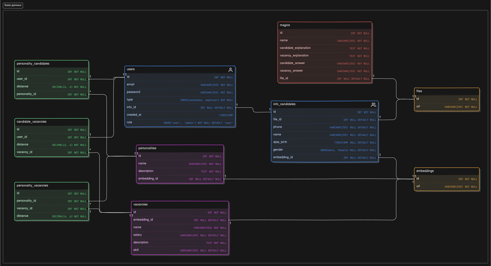

# 

|  | <a href="https://git.io/typing-svg"></a> |
|-----------------------------------------------------------------------|--------------------------------------------------------------------------------------------------------------------------------------------------------------------------------------------------------------------------------------------------------|


---

**HireSnap** — инструмент для оценки кандидатов на основе анализа их личностного типа по системе OCEAN. Тип личности каждого кандидата определяется на основе видео-визитки, где модель анализирует как речь, так и визуальные характеристики (возможно, эмоции). Инструмент также позволяет перевести оценку личности по системе OCEAN в систему MBTI, таким образом предоставляя два типа оценок личности. Работодатели могут использовать **HireSnap** для ранжирования кандидатов по степени соответствия их личностных черт требованиям вакансии, что упрощает подбор подходящих сотрудников на основе личностных характеристик.

---


### Внешний вид графического интерфейса на React:

|  |  |
|------------------------------------------------|--------------------------------------------------|


Все страницы сайта можно посмотреть [**здесь**](./src/images/HireSnap.pdf) <br/>
Презентация проекта находится [**здесь**](./src/images/HireSnap_presentation.pdf)


- [Структура репозитория](#структура-репозитория)
- [Необходимые требования](#требования)
- [Установка и настройка](#установка-и-настройка)
  - [Установка виртуальной среды и зависимостей](#1-установка-виртуальной-среды-и-зависимостей)
    - [Linux server](#linuxmacos)
    - [Windows server](#windows)
  - [Запуск тестов](#2-запуск-тестов)
    - [Linux server](#linuxmacos-1)
    - [Windows server](#windows-1)

 ## Структура репозитория

```
    HireSnap/
    ├── logs/ - Папка для хранения логов
    |   ├── setup/
    |   |   ├── *.log
    |   └── app.log
    ├── setup/ - Кастомный установщик среды
    ├── src/
    |   ├── database/ - База данных
    |   ├── modelling/ - Основные модульные скрипты
    |   ├── pipeline/ - пайплайны
    |   |   ├── server.py - uvicorn сервер
    |   |   ├── test.py - тесты CRUD операций
    |   ├── services/ - Сервисы
    |   |   ├── file_services.py
    |   |   └── ...
    |   ├── utils/ - Дополнительные файлы
    |   |   └── ...
    ├── venv - виртуальная среда
    ├── .env - переменные среды
    ├── .gitignore
    ├── clear_setup_log.py - очистка логов
    ├── create_sql.py - скрипт для авто создания и заполнения базы данных
    ├── env.py - скрипт для работы с переменными средами
    ├── main.bat - запуск сервера на Windows
    ├── main.sh - запуск сервера на linux
    ├── HireSnap.sql - sql скрипт для создания базы данных
    ├── requirements.txt - список зависимостей
    ├── requirements_windows_tensorflow.txt - дополнительный список зависимостей
    ├── server.sh - скрипт для запуска сервера на linux через pm2
    ├── setup.bat - установка среды на windows
    ├── setup.log - файл лога
    └── setup.sh - установка среды на linux
```


### Реляционная база данных:




  ## Требования
- Python 3.9+ 
- `pm2` (для управления процессами сервера на Linux/MacOS)


## Установка и настройка

### 1. Установка виртуальной среды и зависимостей

* Клонируйте репозиторий на сервер:
  ```cmd
    git clone https://github.com/Prischli-Drink-Coffee/HireSnap.git
    cd HireSnap
  ```

* Запустите скрипт для установки виртуальной среды и всех необходимых зависимостей:

  **Linux/MacOS^**

  ```bash
    bash setup.sh
  ```

  **Windows^**
  ```cmd
    setup.bat
  ```

* Следуйте инструкциям в консоли для установки пакетов

### 2. Запуск сервера

* Запустите скрипт через pm2 для Linux/MacOS
    ```bash
    pm2 start 'bash pm2.sh'
    ```
* Запустите через меню выбора для **Linux/MacOS**. Необходимо выбрать пункт 3.
    ```bash
    main.sh
    ```
* Запустите скрипт для запуска сервера на **Windows**. Необходимо выбрать пункт 3.
    ```cmd
    main.bat
    ```

### 3. Запуск тестов CRUD операций базы данных

Для запуска автоматической проверки тестов с использованием `pytest`, выполните:

- **Linux/MacOS**:
  ```bash
  bash main.sh (Пункт с pytest)
  ```

- **Windows**:
  ```cmd
  main.bat (Пункт с pytest)
  ```

### Переменные среды

Сервер можно запустить локально или в веб-пространстве, тогда вы получите доступ к пользовательскому интерфейсу, для настройки сервера достаточно указать переменные среды в таком формате:

```markdown
  DATA_PATH=./data; <br/>
  WEIGHTS_PATH=./src/weights; <br/>
  METRICS_PATH=./src/metrics; <br/>
  HOST=HOST; <br/>
  SERVER_PORT=PORT; <br/>
  DB_HOST=HOST <br/>
  DB=DATABASE; <br/>
  DB_PORT=PORT; <br/>
  DB_USER=USER; <br/>
  DB_PASSWORD=PASSWORD; <br/>
  SECRET_KEY=SECRET_KEY <br/>
```


## Инференс модели определения типа личности (OCEAN)

Получение оценок личности по системам MBTI и OCEAN на основе видео-визиток реализовано в скрипте `inference.sh`. Для того, чтобы его запустить, следуюте следующим инструкциям:
1. После клонирования репозитория, создайте рабочую папку - в ней будут храниться входные, промежуточные и выходные файлы инструмента. 

```bash
  mkdir your_folder
```

2. В этой папке необходимо создать папку `video`:

```bash
  mkdir your_folder/video
```

3. Загрузите в папку `video` видо-визитки кандидатов. 

4. Запустите **HireSnap** - выполняйте эту команду в папке репозитория:

```bash
  ./inference.sh your_folder/
```


5. После отработки инструмента в папке `your_folder` должны появиться два файла:
  - `ocean_results.pkl` - словарь, где для каждой характеристики системы OCEAN и каждой видео-визитки указано, насколько данный кандидат характеризуется данной чертой (от 0 до 1).
  - `mbti_results.pkl` - словарь, где для каждой видео-визитки указан тип MBTI (без оценок принадлежности)

При необходимости, Вы можете изменить названия файлов внутри скрипта.

## Пайплайн определения типа личности (OCEAN)

Если Вы хотите обучить модель на своих данных, Вы можете следовать нашему пайплайну. Его также можно использовать и для инференса модели (заместо предыдущего пункта) - тогда пропустите шаг с обучением модели.

### I. Получение текстовых эмбеддингов
Основная модальность работы нашего инструмента - текст. Мы получаем векторные представления для речи кандидата, описания вакансии, а также описания характеристик системы OCEAN. Данные векторные представления мы получаем из предобученный *BERT-like* модели.

1. **Текстовый эмбеддинг речи кандидата.**

Для того, чтобы получить текстовое представление для видео-визитки, мы транскрибируем аудио из видео-визитки в текст. Транскрипция аудио осуществляется с помощью предобученной модели *wav2vec2*. Чтобы получить текстовое представление для речи кандидата, запустите в командной строке:

```bash
  python src/modelling/video_to_text.py --video_folder <video_folder>  --audio_folder <audio_folder> --table_path <transcription_table>
```

- `video_folder` - Папка с видео-визитками кандидатов (видео формата `.mp4`)
- `audio_folder` - Промежуточная папка с аудио-файлами, которые были получены из соответствующих видео-визиток. Удаляется после выполнения команды
- `table_path` - Результат выполнения текущей команды. Таблица формата `.csv` с двумя колонками: **candidate**, содержащая наименование видео-файлов, и **speech**, содержаща транскрипцию видео (речь кандидата)

Далее, с помощью предобученной модели BERT необходимо получить текстовое представление речи кандидата. Для этого выполните:

```bash
  python src/modelling/get_text_embedding.py --path_to_texts <transcription_table> --output_folder <user_text_embedding_folder>
```

- `path_to_texts` - Результат выполнения *предыдущей* команды. Таблица формата `.csv` с двумя колонками: **candidate**  и **speech**
- `output_folder` - Папка, в которую будут сохранены текстовые эмбеддинги речи кандидатов (по одному файлу на одну визитку, название файла соответствует изначальному наименованию видео-визитки)

2. **Текстовый эмбеддинг описания вакансии.**

Также с помощью BERT-like модели получаем текстовое представление описания вакансий. Описание вакансий, использованное нами Вы можете найти в [открытом доступе](https://www.kaggle.com/datasets/kshitizregmi/jobs-and-job-description). Вы можете использовать как этот же датасет, так и свой. Получите векторное представление для вакансий следующей командой:

```bash
  python src/modelling/get_text_embedding.py --path_to_texts <vacancies_description_table> --output_folder <vacancies_embedding_folder> --disable_candidates
```

- `path_to_texts` - Таблица формата `.csv` с описанием вакансий. В первой колонке должно быть название вакансии. Во второй колонке - описание этой вакансии
- `output_folder` - Папка, в которую будут сохранены текстовые эмбеддинги описания вакансии (по одному файлу на одну вакансию, название файла соответствует индексу вакансии из входной таблицы)
- `--disable_candidates` - флаг, указывающий на то, что сохранять текстовый эмбеддинг необходимо по индексу вакансии, а не по названию этой вакансии (необходимо было сделать, так как вакансии могут содержать пробелы)

3. **Текстовый эмбеддинг описания характеристик OCEAN.**

Получите векторное представление для характеристик OCEAN (пяти из них) следующей командой:

```bash
  python src/modelling/get_text_embedding.py --path_to_texts <vacancies_description_table> --output_folder <personalities_embedding_folder> --disable_candidates
```

- `path_to_texts` - Таблица формата `.csv` с описанием вакансий. В первой колонке должно быть название характеристики. Во второй колонке - описание этой черты
- `output_folder` - Папка, в которую будут сохранены текстовые эмбеддинги описания характеристики OCEAN (по одному файлу на одну характеристику, название файла соответствует индексу черты из входной таблицы)

### II. Получение видео-эмбеддингов

Видео-эмбеддинг характеризует визуальную информацию о кандидате - он может содержать информацию об эмоциях кандидатов, количестве их движений или степени неуверенности. Для характеристики типа личности данная модальность является важной - "язык тела" о человеке может сказать больше, чем он сам. 

1. **Извлечение кадров**
Для получения видео-эмбеддинга необходимо сначала извлечь кадры (frames) - несколько картинок - из каждого видео. Для этого выполните команду:

```bash
  python src/modelling/get_frames.py <video_folder> <frames_folder>
```

- `video_folder` - Папка с видео-визитками кандидатов (видео формата `.mp4`)
- `frames_folder` - Промежуточная папка. Содержит папки с кадрами каждой из видио-визиток (формата `.jpg`)

По умолчанию извлекается 10 кадров в секунду из каждого видео. То есть если длительность Вашего видео 5 секунд, будет извлечено 50 кадров из видео. Вы можете изменить частоту извлечения кадров в файле `src/modelling/get_frames.py`, заменив значение параметра `fps`. 

2. **Обучение видео-модели** 

Мы использовали [Cosmos-Tokenizer](https://github.com/NVIDIA/Cosmos-Tokenizer?tab=readme-ov-file) для получения общего представления о **видео**. Для того, чтобы его запустить, сначала выполните:

```bash
  export PYTHONPATH=$PYTHONPATH:path/to/HireSnap/cosmos_tokenizer
```

Выполните эту команду, даже если Вы не планируете обучать модель!

Выходом *Cosmos-Tokenizer* является сжатое 3D-представление о видео, которое характеризует его "динамично". Однако, для совмещения визуальных и текстовых представлений, нам необходимо 1D-представление о видео. Поэтому мы обучаем *UNET* - получать репрезентативное 1D-представление для 3D-эмбеддинга из Cosmos-Tokenizer. Для того, чтобы обучить UNET на ваших данных, выполните:

```bash
  python get_video_embedding.py --data_dir <frames_folder> --batch_size <batch_size> --num_frames <num_frames> --num_epochs <num_epochs> --learning_rate <learning_rate> --weights_path <weights_path> --model_state "train"
```
- `data_dir` - Папка, содержащая папки с кадрами каждой из видио-визиток (формата `.jpg`). Соответствует `frames_folder` предыдущего шага. 
- `weights_path` - Путь к файлу, в котором будут сохранены веса UNET (формата `pth`)
- `num_frames` - Количество кадров, которое Вы хотите использовать для получение 3D-эмбеддинга моделью *Cosmos-Tokenizer*. 

3. **Инференс видео-модели**

Для того, чтобы получить визуальные эмбеддинги о видео-визитках на основе обученной модели UNET, выполните следующую команду:

```bash
python src/modelling/get_video_embedding.py --data_dir <frames_folder> --batch_size 1 --weights_path <weights_path> --model_state "inference" --embeddings_path <user_video_embedding_folder>
```

- `embeddings_path` - Папка, в которую будут сохранены видео-эмбеддинги кандидатов (по одному файлу на одну визитку, название файла соответствует изначальному наименованию видео-визитки)

### III. Получение мультимодального представления кандидата

Для того, чтобы объединить визуальное и текстовое представления о видио-визитке, мы нормализовали и усреднили вектора обеих модальностей. Для этого выполните команду:

```bash
  python src/modelling/get_common_embedding.py --video_embedding_folder <user_video_embedding_folder> --text_embedding_folder <user_text_embedding_folder> --output_folder <user_embedding_folder>
```

- `video_embedding_folder` - Папка, в которой сохранены видео-эмбеддинги кандидатов из предыдущего пункта
- `text_embedding_folder` - Папка, в которой сохранены текстовые эмбеддинги речи кандидатов  из первого пункта
- `user_embedding_folder` - Папка, в которой будут сохранены объединенные эмбеддинги речи и изображений кандидатов

### IV. Итоговое получение оценок личности

Для того, чтобы получить итоговую аннотацию по типам личности MBTI и OCEAN, мы рассчитываем косинусное сходство (также есть возможности использовать корреляцию Пирсона) между мультимодальным представлением вакансии и текстовым представлением каждой из характеристик OCEAN. 

```bash
  python src/modelling/submit.py <user_embedding_folder> <personalities_embedding_folder> --metric 'cosine' --o <output_file>
```

- `metric` - или косинусное сходство (cosine), или корреляция Пирсона (pearson)
- `--o` - Результат выполнения функции, `pkl` файл, содержащий меерику сходства между векторами OCEAN и кандидатов. Интерпретируется как соответствие кандидата данной черте.  


Для перевода в MBTI мы использовали "ручной" перевод на основе сопоставления черт OCEAN и MBTI. Если Вы хотите для каждого кандидата получить его тип личности по MBTI, воспользуйтесь:

```bash
  python src/modelling/mbti.py <user_embedding_folder> <personalities_embedding_folder> --metric 'cosine' --o <output_file>
```
- `metric` - или косинусное сходство (cosine), или корреляция Пирсона (pearson). 
- `--o` - Результат выполнения функции, `pkl` файл, содержащий класс MBTI для каждого кандидата

## Пайплайн мэтчинга вакансий и кандидатов

После создания представлений для вакансий, характеристик OCEAN и кандидатов мы можем установить соответствие между кандидатами и вакансиями. Мы рассчитываем "степень соответствия" для кандидатов и вакансий относительно характеристик OCEAN. Для оценки соответствия используем косинусное расстояние (или корреляцию Пирсона), нормированное в диапазон [0, 1].

- \( h \) — размерность скрытого пространства (в нашем случае, 384).
- \( V \) — матрица вакансий размерности [количество вакансий, h].
- \( U \) — матрица кандидатов размерности [количество кандидатов, h].
- \( O \) — матрица характеристик OCEAN размерности [5, h].

Таким образом, **сходство \( s_u \) между кандидатами и характеристиками OCEAN** рассчитывается через косинусную близость между их векторами:

\[
s_u = \text{cosine}(U, O^T)
\]

Размерность \( s_u \): [количество кандидатов, 5].

Для получения значений в диапазоне [0, 1] (процент выраженности каждой характеристики у кандидата) нормализуем сходство:

\[
s_u := \frac{s_u + 1}{2}
\]

**Аналогично** вычисляем сходство между вакансиями и характеристиками OCEAN:

\[
s_v = \frac{\text{cosine}(V, O^T) + 1}{2}
\]

Размерность \( s_v \): [количество вакансий, 5].

Таким образом, для каждого кандидата и вакансии определено соответствие пяти характеристикам OCEAN. Мы предполагаем, что *взаимосвязь кандидата и вакансии осуществляется через типы личности OCEAN* следующим образом:

\[
W = (s_u \times s_v^T) + (1 - s_u) \times (1 - s_v^T)
\]

Где \( W \) — матрица схожести кандидатов и вакансий, размерности [количество кандидатов, количество вакансий].

Эта матрица позволяет **ранжировать вакансии** по степени соответствия для каждого кандидата и, наоборот, **ранжировать кандидатов** по степени соответствия для каждой вакансии.